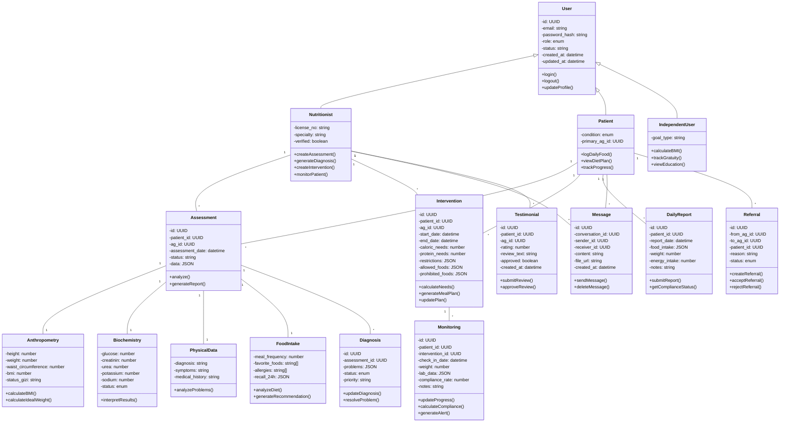
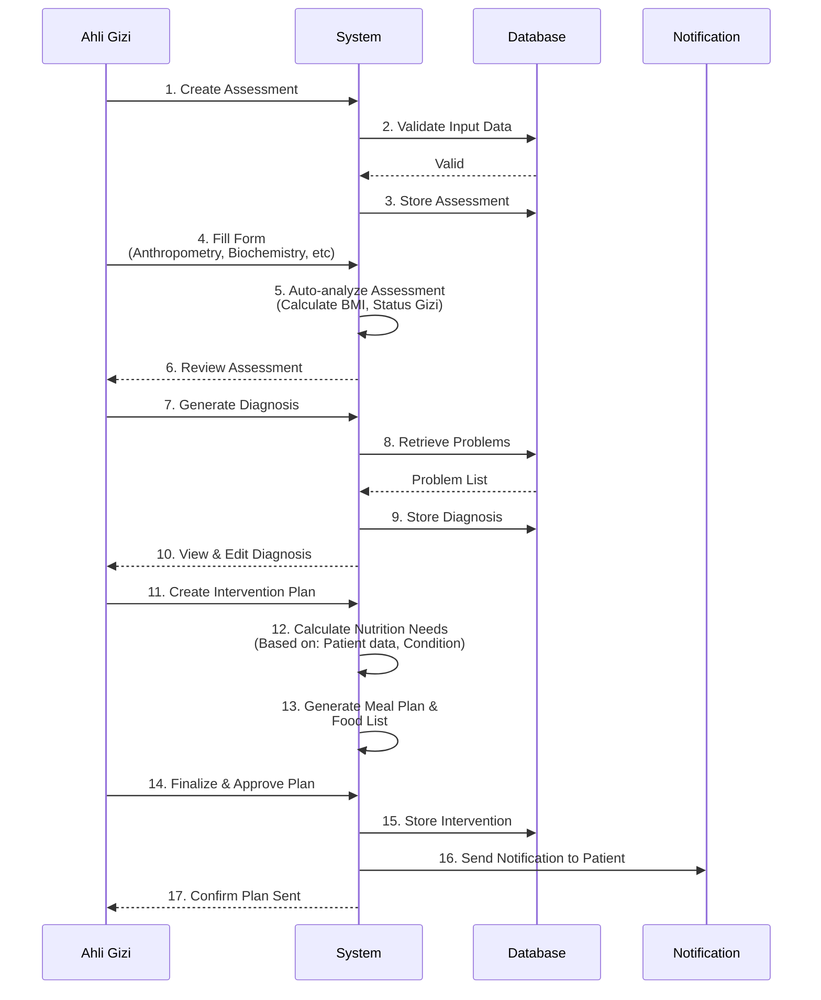
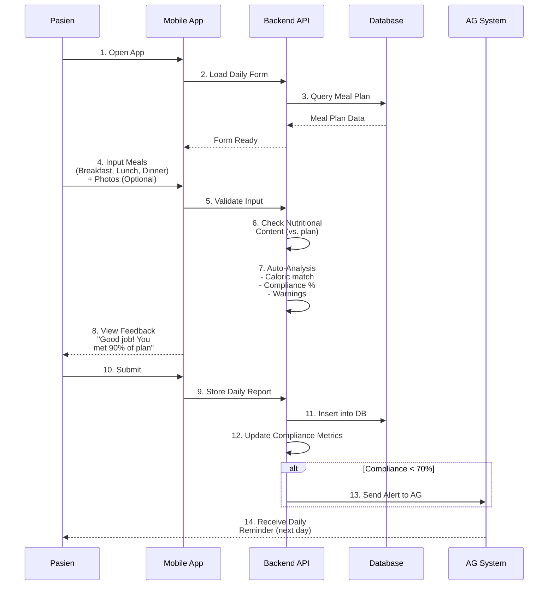
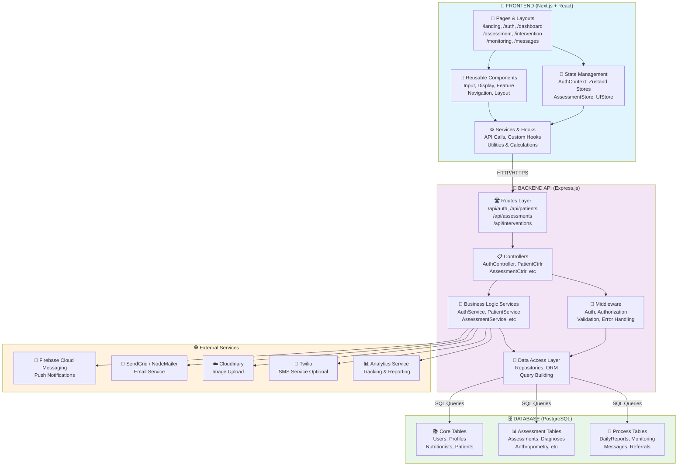
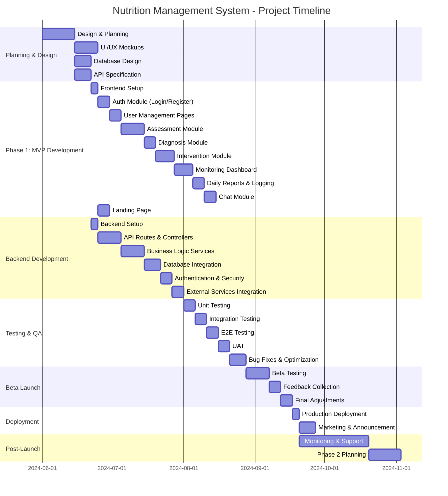
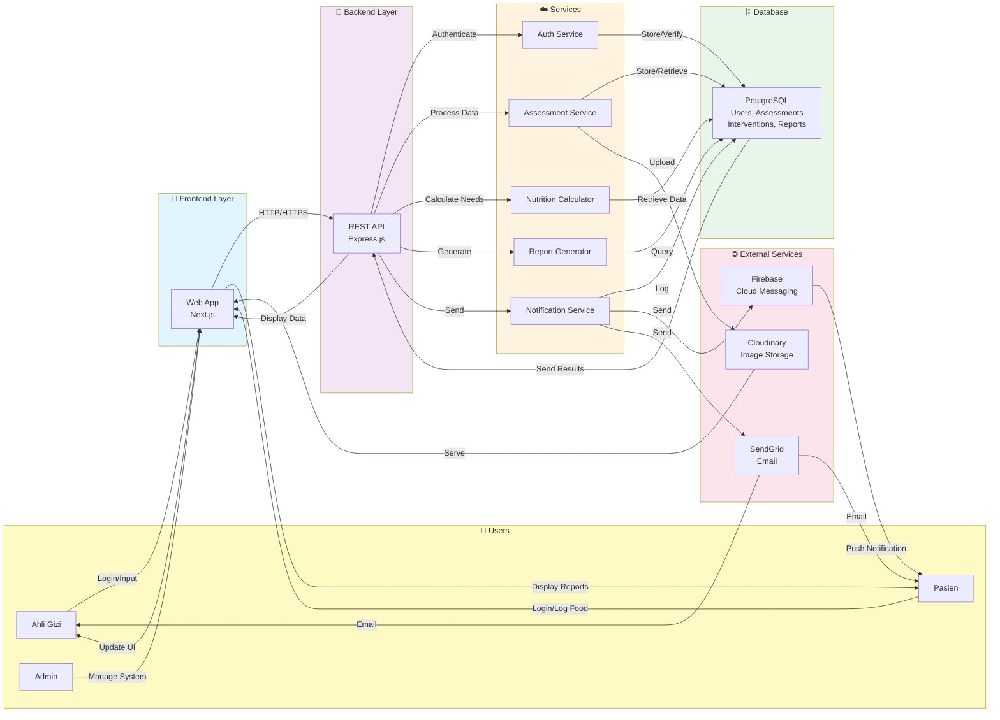

# Product Requirements Document (PRD)
## Clinical Nutrition Management

**Project Name:** Clinical Nutrition Management 
**Version:** 1.0  
**Framework:** Next.js  

---

## 1. Executive Summary

Clinical Nutrition Management adalah platform terpadu yang menghubungkan pasien dan ahli gizi (AG) untuk memberikan asuhan gizi yang terstruktur dan efektif. Platform ini mendukung pengelolaan data gizi pasien secara komprehensif, mulai dari registrasi, assessment, diagnosis, intervensi hingga monitoring berkala.

**Target Users:**
- Ahli Gizi (AG) di rumah sakit, puskesmas, atau praktik mandiri
- Pasien dengan kondisi kesehatan tertentu (ginjal, hipertensi, asam urat)
- Individu yang ingin mengelola gizi mereka secara mandiri

---

## 2. Objectives & Key Results

### Objectives:
1. Menyediakan platform terpusat untuk manajemen asuhan gizi berbasis digital
2. Meningkatkan kualitas asuhan gizi melalui assessment dan monitoring yang terstruktur
3. Meningkatkan kepatuhan pasien terhadap rencana diet melalui teknologi
4. Memfasilitasi kolaborasi efektif antara pasien dan ahli gizi

### Key Results:
- ✅ Implementasi 5 modul utama (Registrasi, Assessment, Diagnosis, Intervensi, Monitoring)
- ✅ Dukungan untuk minimal 3 kondisi penyakit (ginjal, hipertensi, asam urat)
- ✅ User engagement 70%+ dalam 3 bulan pertama
- ✅ Peningkatan kepatuhan diet pasien sebesar 50%

---

## 3. User Personas

### Persona 1: Ahli Gizi Klinis (AG)
- **Name:** Dr. Siti Nurhaliza
- **Role:** Nutritionist at Hospital
- **Goals:** Mengelola asuhan gizi pasien secara efisien, memonitor progress, memberikan intervensi berbasis data
- **Pain Points:** Proses manual yang memakan waktu, sulit melacak progress pasien jangka panjang
- **Device:** Desktop, Tablet

### Persona 2: Pasien Kronis
- **Name:** Budi Santoso
- **Role:** Patient with kidney disease
- **Goals:** Memahami diet yang tepat, mematuhi rencana makan, melihat progress kesehatan
- **Pain Points:** Sulit memahami rekomendasi diet, lupa konsumsi, khawatir dengan kesehatan
- **Device:** Mobile Phone, Tablet

### Persona 3: Health-Conscious Individual
- **Name:** Rina Wijaya
- **Role:** Independent User
- **Goals:** Mengelola gizi secara mandiri, mendapat edukasi gizi, tracking progress
- **Pain Points:** Tidak tahu bagaimana menghitung kebutuhan gizi, perlu edukasi gizi
- **Device:** Mobile Phone, Desktop

---

## 4. Product Features & Scope

### Phase 1: Core Features (MVP)

#### 4.1 Modul Registrasi & Profil
**Purpose:** Mengelola data dasar pengguna sistem

**Features:**
- Registrasi pengguna (Pasien, Ahli Gizi, Independent User)
- Profil pengguna lengkap dengan foto
- Edit profil dan pengaturan akun
- Autentikasi dan otorisasi berbasis role
- Reset password dan email verification

**User Roles:**
- **Admin:** Mengelola pengguna dan sistem
- **Ahli Gizi (AG):** Mengelola pasien dan memberikan asuhan
- **Pasien:** Menerima asuhan dan melaporkan progress
- **Independent User:** Akses fitur mandiri terbatas

---

#### 4.2 Modul Assessment Gizi
**Purpose:** Mengumpulkan dan menganalisis data gizi pasien secara komprehensif

**Sub-Modul:**

**4.2.1 Data Antropometri**
- Input: Tinggi badan (cm), Berat badan (kg), Lingkar pinggang (cm)
- Analisis otomatis:
  - BMI (Body Mass Index) & status gizi
  - Berat badan ideal (BBI)
  - Estimasi berat badan normal
- Visualisasi: Grafik tren BB dari waktu ke waktu
- Input: Hanya oleh AG atau pasien atas instruksi AG

**4.2.2 Data Biokimia**
- Input laboratorium: Kreatinin, Ureum, Kalium, Natrium, Fosfor, Glukosa, Kolesterol, Trigliserida, Hemoglobin, Albumin
- Status interpretasi: Normal/Abnormal/Kritis
- Analisis masalah gizi terkait data lab
- Input: Oleh AG berdasarkan hasil lab pasien

**4.2.3 Data Fisik Klinis**
- Input: Diagnosis medis, pemeriksaan penunjang, gejala klinis
- Riwayat penyakit: Ginjal, Hipertensi, Asam Urat, dll
- Analisis masalah gizi berdasarkan kondisi klinis
- Input: Oleh AG

**4.2.4 Data Kebiasaan Makan & Asupan**
- Input:
  - Frekuensi makan sehari-hari
  - Makanan kesukaan
  - Alergi dan pantangan makanan
  - Preferensi diet (vegetarian, dll)
  - Recall 24 jam: Pencatatan makanan dalam 24 jam terakhir
- Analisis:
  - Tingkat konsumsi (Kelebihan/Kurang)
  - Kebiasaan makan salah
  - Adekuasi nutrisi (Kalori, Protein, Lemak, Karbohidrat)
- Input: Oleh AG atau Pasien

**4.2.5 Data Riwayat Penyakit**
- Input: Riwayat penyakit keluarga, penyakit komorbiditas
- Timeline view: Visualisasi riwayat penyakit
- Input: Oleh AG atau Pasien

---

#### 4.3 Modul Diagnosis Masalah Gizi
**Purpose:** Mengidentifikasi dan merangkum masalah gizi pasien

**Features:**
- Kompilasi otomatis masalah gizi dari assessment
- Diagnosis berbasis standar IDCN (Indonesian Dietetics and Nutrition Terminology)
- List masalah gizi prioritas
- Input/Edit: Hanya oleh AG
- Status diagnosis: Aktif, Resolved, Under Monitoring

---

#### 4.4 Modul Intervensi Gizi
**Purpose:** Merencanakan dan memberikan intervensi gizi yang terukur

**Features:**
- Analisis kebutuhan energi dan zat gizi otomatis berdasarkan:
  - Harris-Benedict untuk BMR
  - Activity factor sesuai kondisi
  - Faktor penyakit (ginjal: batas K, Na, P; hipertensi: batas Na, lemak)
- Kalkulasi kebutuhan harian: Kalori, Protein, Kalium, Natrium, Fosfor, Cairan
- Pembagian makan sehari: Sarapan, Snack pagi, Lunch, Snack sore, Dinner
- Rekomendasi makanan:
  - Daftar makanan yang BOLEH
  - Daftar makanan yang TIDAK BOLEH
  - Portion size recommendations
- Education materials: Leaflet digital, tips gizi, resep sehat
- Plan timeline: Jangka waktu intervensi dan target
- Input/Edit: Hanya oleh AG

---

#### 4.5 Modul Monitoring
**Purpose:** Memantau kepatuhan dan progress pasien secara berkelanjutan

**Features:**

**4.5.1 Dashboard Ahli Gizi**
- Overview pasien aktif
- Grafik: BB, Lab data, Kepatuhan makan
- Alert: Pasien dengan progress buruk atau data overdue
- Riwayat asupan pasien
- Catatan dan rekomendasi untuk pasien

**4.5.2 Laporan Makan Pasien**
- Pasien mencatat: Tanggal, makanan yang dikonsumsi sepanjang hari
- Foto makanan (optional)
- Feedback otomatis: Apakah sesuai rencana atau tidak
- Apresiasi/Motivasi untuk pasien berdasarkan kepatuhan

**4.5.3 Laporan Progress Klinis**
- Tracking progress: BB, data lab, gejala klinis
- Perbandingan dengan baseline
- Analisis trend dan achievement terhadap target
- Laporan periodik: Mingguan, bulanan, quarterly

---

#### 4.6 Modul Laporan & Log
**Purpose:** Dokumentasi dan evaluasi asuhan gizi

**Features:**
- Log harian konsumsi makanan pasien
- Laporan periodik otomatis (weekly, monthly)
- Export laporan: PDF, Excel
- Progress evaluation: Evaluasi setiap periode
- History tracking: Semua aktivitas pasien tersimpan

---

#### 4.7 Notifikasi & Pengingat
**Purpose:** Meningkatkan kepatuhan melalui reminder sistem

**Features:**
- Notifikasi jadwal makan
- Reminder pencatatan harian
- Reminder konsumsi obat/suplemen (optional)
- Reminder follow-up dengan AG
- Push notification, email, SMS (sesuai preferensi)
- Customizable reminder schedule

---

#### 4.8 Modul Rujukan Pasien
**Purpose:** Memfasilitasi transfer asuhan antar AG

**Features:**
- Referral dari RS AG → Puskesmas AG atau praktek mandiri
- Referral sebaliknya
- Riwayat asuhan tetap accessible oleh pasien
- History transfer dan approval workflow
- Status rujukan: Pending, Accepted, Completed

---

#### 4.9 Chat & Komunikasi
**Purpose:** Fasilitasi komunikasi pasien-AG

**Features:**
- Real-time chat pasien ↔ AG
- History chat tersimpan
- Share file/foto dalam chat
- Notification untuk new messages
- Accessibilitas setelah konsultasi berakhir (read-only)

---

### Phase 2: Advanced Features

#### 4.10 Fitur Mandiri untuk Klien Sehat
**Purpose:** Support health-conscious individuals tanpa AG

**Features:**
- Self-assessment gizi mandiri
- Kalkulator status gizi (BMI, BBI)
- Kalkulator asupan gizi seimbang
- Rekomendasi makan sehat umum
- Progress tracking mandiri (tanpa AG)
- Educational content library

---

#### 4.11 Analytics & Reporting
**Purpose:** Business intelligence dan insights

**Features:**
- Analytics dashboard untuk admin/owner
- Metrics:
  - Jumlah AG aktif
  - Jumlah pasien aktif per kategori penyakit
  - Status gizi pasien (aggregated)
  - Kepatuhan diet rate
  - Usage analytics
- Custom reports: Exportable ke Excel/PDF

---

#### 4.12 Testimoni & Review
**Purpose:** Social proof dan trust building

**Features:**
- Rating dan review dari pasien terhadap AG
- Testimonial form
- Display testimonial di landing page
- Filter review by star, date

---

#### 4.13 Landing Page
**Purpose:** Marketing dan onboarding

**Features:**
- Hero section dengan CTA (Sign up / Login)
- Features overview dengan visual
- Benefits untuk pasien dan AG
- Testimonials section
- Pricing (jika applicable)
- FAQ section
- Contact/Support information
- Blog section (optional)

---

## 5. User Flows

### 5.1 Flow: Ahli Gizi Menerima & Mengelola Pasien Baru

```
1. AG Login
2. View Dashboard → "Pasien Baru"
3. Input Pasien Data (Basic Profile)
4. Create Assessment Form
5. Edit Assessment dengan data pasien
6. Auto-analyze Assessment → Generate Diagnosis
7. Create Intervention Plan
8. Share Plan ke pasien
9. Start Monitoring
```

### 5.2 Flow: Pasien Mematuhi Rencana Diet

```
1. Pasien Login
2. View Diet Plan dari AG
3. Daily: Catat makanan yang dikonsumsi
4. Sistem analisis kepatuhan
5. Terima feedback & motivasi
6. Setiap minggu: Lihat progress report
7. Chat dengan AG untuk pertanyaan
```

### 5.3 Flow: Independent User Tracking Gizi Mandiri

```
1. Register tanpa AG
2. Input profil & data kesehatan
3. System calculate kebutuhan gizi
4. Lihat rekomendasi makan sehat
5. Daily tracking makanan
6. Monitor progress metrics
7. Read educational content
```

---

## 6. Technical Requirements

### 6.1 Frontend Stack
- **Framework:** Next.js (App Router recommended)
- **Language:** TypeScript
- **Styling:** Tailwind CSS
- **UI Components:** shadcn/ui atau Material-UI
- **State Management:** React Context API / Zustand
- **Form Management:** React Hook Form
- **Charts & Visualization:** Recharts, Chart.js
- **Date Management:** date-fns atau dayjs
- **HTTP Client:** Axios atau native fetch

### 6.2 Backend Requirements
- **API:** RESTful API (Node.js/Express recommended)
- **Database:** PostgreSQL (relational + JSONB for flexibility)
- **Authentication:** JWT + Refresh Token
- **File Upload:** Cloudinary / AWS S3
- **Notifications:** Firebase Cloud Messaging / NodeMailer
- **Search:** ElasticSearch (optional, for analytics)

### 6.3 Infrastructure
- **Deployment:** Vercel / AWS EC2
- **Database Hosting:** AWS RDS / Supabase
- **CDN:** CloudFront / Cloudflare
- **SSL Certificate:** Let's Encrypt

### 6.4 Performance Requirements
- Page load time: < 3s (First Contentful Paint)
- Lighthouse score: > 80
- Mobile responsive: All screen sizes (320px - 2560px)
- Accessibility: WCAG 2.1 AA compliance

### 6.5 Security Requirements
- HTTPS everywhere
- Data encryption at rest and in transit
- SQL injection prevention (ORM/Parameterized queries)
- CSRF protection
- XSS prevention
- Input validation & sanitization
- Rate limiting
- HIPAA compliance (untuk health data)
- GDPR compliance (untuk data privacy)

---

## 7. Database Schema Overview

```
Users
├── id, email, password_hash, role (enum), status
├── created_at, updated_at

Profiles
├── id, user_id, full_name, date_of_birth, gender
├── phone, address, photo_url

Patients
├── id, user_id, primary_ag_id (FK: Users)
├── condition (enum: kidney, hypertension, gout)

Assessments
├── id, patient_id, ag_id, assessment_date
├── data (JSON: anthropometry, biochemistry, clinical, food_intake, history)

Diagnoses
├── id, assessment_id, diagnosis_list (JSON array)

Interventions
├── id, patient_id, ag_id, start_date, target_date
├── caloric_needs, protein_needs, limitations (JSON)
├── allowed_foods (JSON), prohibited_foods (JSON)

DailyReports
├── id, patient_id, report_date
├── food_intake (JSON), weight, notes

Monitoring
├── id, patient_id, last_weight, last_lab_date
├── compliance_rate, achievement_vs_target

Messages
├── id, sender_id, receiver_id, content, created_at

Referrals
├── id, from_ag_id, to_ag_id, patient_id, status, created_at

Testimonials
├── id, patient_id, ag_id, rating, review_text, created_at
```

---

## 8. API Endpoints (High-level)

```
AUTH
  POST /api/auth/register
  POST /api/auth/login
  POST /api/auth/refresh
  POST /api/auth/logout

USERS & PROFILES
  GET /api/users/:id
  PUT /api/users/:id
  GET /api/profiles/:user_id
  PUT /api/profiles/:user_id

PATIENTS
  GET /api/patients (for AG)
  POST /api/patients (AG adds new patient)
  GET /api/patients/:id
  PUT /api/patients/:id

ASSESSMENTS
  POST /api/assessments (AG creates)
  GET /api/assessments/:patient_id
  PUT /api/assessments/:id

DIAGNOSES
  GET /api/diagnoses/:assessment_id
  POST /api/diagnoses (auto-generated)

INTERVENTIONS
  POST /api/interventions (AG creates plan)
  GET /api/interventions/:patient_id
  PUT /api/interventions/:id

DAILY REPORTS
  POST /api/daily-reports (Patient logs food)
  GET /api/daily-reports/:patient_id
  PUT /api/daily-reports/:id

MONITORING
  GET /api/monitoring/:patient_id (Dashboard data)
  POST /api/monitoring/:patient_id/check-in

MESSAGES
  POST /api/messages (Send message)
  GET /api/messages/:conversation_id
  GET /api/conversations (List chats)

REFERRALS
  POST /api/referrals (Create referral)
  PUT /api/referrals/:id/accept
  PUT /api/referrals/:id/reject

TESTIMONIALS
  POST /api/testimonials (Patient leaves review)
  GET /api/testimonials (Get all, public)
  DELETE /api/testimonials/:id (Own testimonial)

ANALYTICS
  GET /api/analytics/dashboard (Admin)
  GET /api/analytics/patient-demographics
  GET /api/analytics/compliance-rate
```

---

## 9. Landing Page Sections

1. **Header/Navigation**
   - Logo, Nav menu, CTA buttons (Sign In, Sign Up)
   - Responsive mobile menu

2. **Hero Section**
   - Compelling headline
   - Subheadline + benefit statement
   - Hero image/illustration
   - Primary CTA (Get Started)

3. **Features Section**
   - 6-8 key features dengan icons
   - Brief description per feature

4. **Benefits Section**
   - For Nutritionists: Time-saving, Better monitoring, etc.
   - For Patients: Easy tracking, Get motivated, etc.

5. **How It Works**
   - 3-4 steps visualized
   - Flowchart style

6. **Testimonials Section**
   - 3-5 testimonials from users
   - Star ratings
   - User name, role

7. **Supported Conditions**
   - Kidney Disease
   - Hypertension
   - Gout/Hyperuricemia

8. **Call to Action Section**
   - "Ready to get started?"
   - Sign up button

9. **FAQ Section**
   - 5-8 common questions
   - Accordion style

10. **Footer**
    - Links, contact info
    - Social media
    - Copyright

---

## 10. Success Metrics

| Metric | Target | Timeline |
|--------|--------|----------|
| User Registration | 500+ users | 6 months |
| Monthly Active Users | 300+ MAU | 6 months |
| Patient Compliance Rate | 70%+ | 6 months |
| AG Satisfaction Score | 4.5/5 | 6 months |
| App Availability | 99.9% uptime | Ongoing |
| Average Session Duration | 15+ min | 3 months |
| Page Load Time | < 3s | Ongoing |

---

## 11. Risk & Mitigation

| Risk | Impact | Probability | Mitigation |
|------|--------|------------|------------|
| Data privacy compliance | High | Medium | Early consultation dengan legal, implement HIPAA/GDPR from start |
| Complex calculation logic | High | Medium | Unit tests, validation with AG experts |
| User adoption rate low | High | Medium | Strong UX, onboarding materials, training program |
| Integration with hospital systems | Medium | High | Plan API contracts early, test with real systems |
| Scalability issues at peak load | High | Low | Load testing, horizontal scaling, CDN |

---

## 12. Out of Scope (Phase 1)

- Integration dengan existing hospital EHR systems (Phase 2)
- Advanced AI/ML recommendations (Phase 2)
- Wearable device integration (Phase 2)
- Multi-language support initially (Phase 2)
- Video consultation features (Phase 2)
- Pharmacy integration (Phase 2)

---

## 13. UML Diagrams

### 13.1 Class Diagram (Domain Model)



---

### 13.2 Use Case Diagram

```mermaid
graph TB
    subgraph Actors
        AG["👨‍⚕️ Ahli Gizi (AG)"]
        Patient["👤 Pasien"]
        Admin["🔐 Admin"]
        IndepUser["👥 Independent User"]
    end

    subgraph PatientManagement
        ManageReg["Manage Patient Registration"]
        CreateAssess["Create Assessment"]
        GenDiagnosis["Generate Diagnosis"]
        CreateIntervention["Create Intervention Plan"]
    end

    subgraph Monitoring
        MonitorProgress["Monitor Patient Progress"]
        GenReports["Generate Reports"]
        Dashboard["View Dashboard"]
        ComplianceCheck["Check Compliance"]
    end

    subgraph Communication
        ChatAG["Chat with Patient"]
        SendNotif["Send Notifications"]
        CreateReferral["Create Referral"]
    end

    subgraph PatientActivities
        ViewPlan["View Diet Plan"]
        LogFood["Log Daily Food Intake"]
        TrackProgress["Track Progress"]
        ViewReport["View Monitoring Report"]
        ReceiveNotif["Receive Notifications"]
        ChatPatient["Chat with AG"]
        LeaveTestimonial["Leave Testimonial"]
    end

    subgraph AdminActivities
        ManageUsers["Manage Users"]
        ViewAnalytics["View System Analytics"]
        MonitorHealth["Monitor System Health"]
        ConfigSettings["Configure Settings"]
    end

    subgraph IndepActivities
        SelfAssess["Self-Assessment Gizi"]
        CalcNeeds["Calculate Nutrition Needs"]
        GetRecommendation["Get Diet Recommendations"]
        TrackIndep["Track Food Intake"]
        ReadEducation["Read Educational Content"]
    end

    AG -->|performs| ManageReg
    AG -->|performs| CreateAssess
    AG -->|performs| GenDiagnosis
    AG -->|performs| CreateIntervention
    AG -->|performs| MonitorProgress
    AG -->|performs| GenReports
    AG -->|performs| Dashboard
    AG -->|performs| ComplianceCheck
    AG -->|performs| ChatAG
    AG -->|performs| SendNotif
    AG -->|performs| CreateReferral

    Patient -->|performs| ViewPlan
    Patient -->|performs| LogFood
    Patient -->|performs| TrackProgress
    Patient -->|performs| ViewReport
    Patient -->|performs| ReceiveNotif
    Patient -->|performs| ChatPatient
    Patient -->|performs| LeaveTestimonial

    Admin -->|performs| ManageUsers
    Admin -->|performs| ViewAnalytics
    Admin -->|performs| MonitorHealth
    Admin -->|performs| ConfigSettings

    IndepUser -->|performs| SelfAssess
    IndepUser -->|performs| CalcNeeds
    IndepUser -->|performs| GetRecommendation
    IndepUser -->|performs| TrackIndep
    IndepUser -->|performs| ReadEducation
```



---

### 13.3 Sequence Diagram: Patient Assessment & Intervention Creation



---

### 13.4 Sequence Diagram: Patient Daily Food Logging & Monitoring



---

### 13.5 Entity Relationship Diagram (ERD)

```mermaid
erDiagram
    USERS ||--o{ PROFILES : has
    USERS ||--o{ NUTRITIONISTS : is_a
    USERS ||--o{ PATIENTS : is_a
    USERS ||--o{ INDEPENDENT_USERS : is_a
    
    NUTRITIONISTS ||--o{ ASSESSMENTS : creates
    NUTRITIONISTS ||--o{ INTERVENTIONS : creates
    NUTRITIONISTS ||--o{ TESTIMONIALS : receives
    NUTRITIONISTS ||--o{ MESSAGES : sends_receive
    NUTRITIONISTS ||--o{ REFERRALS : creates
    
    PATIENTS ||--o{ ASSESSMENTS : has
    PATIENTS ||--o{ INTERVENTIONS : has
    PATIENTS ||--o{ DAILY_REPORTS : submits
    PATIENTS ||--o{ MONITORING : tracked_by
    PATIENTS ||--o{ MESSAGES : sends_receive
    PATIENTS ||--o{ TESTIMONIALS : leaves
    PATIENTS ||--o{ REFERRALS : subject_of
    
    ASSESSMENTS ||--o{ DIAGNOSES : generates
    ASSESSMENTS ||--o{ ANTHROPOMETRY : contains
    ASSESSMENTS ||--o{ BIOCHEMISTRY : contains
    ASSESSMENTS ||--o{ PHYSICAL_DATA : contains
    ASSESSMENTS ||--o{ FOOD_INTAKE : contains
    
    INTERVENTIONS ||--o{ MONITORING : tracked_by
    INTERVENTIONS ||--o{ DAILY_REPORTS : relates_to
    
    CONVERSATIONS ||--o{ MESSAGES : contains
    
    USERS {
        uuid id PK
        string email UK
        string password_hash
        enum role
        string status
        datetime created_at
        datetime updated_at
    }
    
    PROFILES {
        uuid id PK
        uuid user_id FK
        string full_name
        date dob
        enum gender
        string phone
        string address
        string photo_url
    }
    
    NUTRITIONISTS {
        uuid id PK "FK to Users"
        string license_no
        string specialty
        boolean verified
        datetime verified_date
    }
    
    PATIENTS {
        uuid id PK "FK to Users"
        enum condition
        uuid primary_ag_id FK
    }
    
    INDEPENDENT_USERS {
        uuid id PK "FK to Users"
        string goal_type
        datetime tracking_date
    }
    
    ASSESSMENTS {
        uuid id PK
        uuid patient_id FK
        uuid ag_id FK
        datetime assessment_date
        enum status
        json data
    }
    
    ANTHROPOMETRY {
        uuid id PK
        uuid assessment_id FK
        decimal height
        decimal weight
        decimal waist_circumference
        decimal bmi
        string status_gizi
    }
    
    BIOCHEMISTRY {
        uuid id PK
        uuid assessment_id FK
        decimal glucose
        decimal creatinin
        decimal urea
        decimal potassium
        decimal sodium
        enum status
    }
    
    PHYSICAL_DATA {
        uuid id PK
        uuid assessment_id FK
        string diagnosis
        string symptoms
        string medical_history
    }
    
    FOOD_INTAKE {
        uuid id PK
        uuid assessment_id FK
        integer meal_frequency
        json favorite_foods
        json allergies
        json recall_24h
    }
    
    DIAGNOSES {
        uuid id PK
        uuid assessment_id FK
        json problems
        enum status
        string priority
        datetime created_at
    }
    
    INTERVENTIONS {
        uuid id PK
        uuid patient_id FK
        uuid ag_id FK
        date start_date
        date end_date
        decimal caloric_needs
        decimal protein_needs
        json restrictions
        json allowed_foods
        json prohibited_foods
        enum status
    }
    
    MONITORING {
        uuid id PK
        uuid patient_id FK
        uuid intervention_id FK
        date check_in_date
        decimal weight
        json lab_data
        decimal compliance_rate
        string notes
    }
    
    DAILY_REPORTS {
        uuid id PK
        uuid patient_id FK
        date report_date
        json food_intake
        decimal weight
        decimal energy_intake
        string notes
        decimal compliance
    }
    
    CONVERSATIONS {
        uuid id PK
        uuid participant1_id FK
        uuid participant2_id FK
        datetime created_at
        datetime last_message_at
    }
    
    MESSAGES {
        uuid id PK
        uuid conversation_id FK
        uuid sender_id FK
        uuid receiver_id FK
        string content
        string file_url
        datetime created_at
    }
    
    TESTIMONIALS {
        uuid id PK
        uuid patient_id FK
        uuid ag_id FK
        integer rating
        string review_text
        boolean approved
        datetime created_at
    }
    
    REFERRALS {
        uuid id PK
        uuid from_ag_id FK
        uuid to_ag_id FK
        uuid patient_id FK
        string reason
        enum status
        datetime created_at
        datetime completed_at
    }
```



---

### 13.6 State Diagram: Patient Workflow

```mermaid
stateDiagram-v2
    [*] --> Registered
    
    Registered --> AssessmentInProgress: AG starts assessment
    
    AssessmentInProgress --> DiagnosisIdentified: Assessment complete
    
    DiagnosisIdentified --> PlanCreated: AG creates intervention plan
    
    PlanCreated --> UnderMonitoring: Patient reads & starts following
    
    UnderMonitoring --> GoalAchieved: Patient reaches goal
    UnderMonitoring --> NoProgress: No progress in monitoring
    UnderMonitoring --> ReferredToAnother: Referred to another AG
    
    GoalAchieved --> Completed: Patient discharged
    Completed --> [*]
    
    NoProgress --> UnderMonitoring: New intervention plan created
    
    ReferredToAnother --> ReferralDecision: Awaiting decision
    ReferralDecision --> ReferredOut: Referral accepted
    ReferralDecision --> UnderMonitoring: Referral rejected
    
    ReferredOut --> [*]
    
    UnderMonitoring -.->|Patient re-engage| UnderMonitoring
```

---

### 13.7 Component Architecture Diagram (Next.js Stack)



---

### 13.8 Project Timeline (Gantt Chart)



### A. Condition-Specific Calculation Rules

**Kidney Disease (Chronic Kidney Disease)**
- Protein restriction: 0.6-0.8 g/kg IBW
- Sodium limit: < 2,300 mg/day
- Potassium limit: < 2,000 mg/day
- Phosphorus limit: < 1,000 mg/day
- Fluid restriction: Based on urine output

**Hypertension**
- Sodium limit: < 2,300 mg/day (DASH diet approach)
- Caloric needs: Based on target weight
- Emphasis on fruits, vegetables, whole grains
- Limit saturated fat: < 10% total calories

**Gout/Hyperuricemia**
- Purine restriction: < 100 mg/day
- Hydration: > 2L water/day
- Limit high-purine foods: Organ meats, seafood, red meat
- Avoid alcohol, especially beer
- Limit fructose

---

---

### 13.9 Data Flow Diagram (DFD) - Level 1



---

## 14. Glossary

| Term | Definition |
|------|-----------|
| AG (Ahli Gizi) | Nutrition specialist / Registered Dietitian |
| BMI | Body Mass Index (weight/height²) |
| BBI | Berat Badan Ideal (Ideal Body Weight) |
| Assessment | Comprehensive nutrition evaluation |
| Diagnosis | Nutrition-related problem identification |
| Intervention | Nutrition care plan |
| Monitoring | Tracking patient compliance & progress |
| Recall 24 jam | Food intake log for 24-hour period |
| Leaflet | Educational handout |
| Comorbidity | Concurrent medical conditions |
